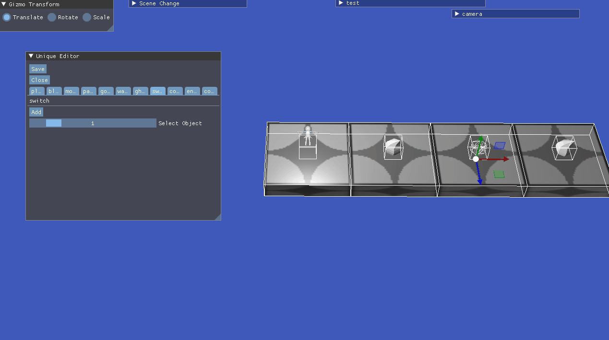
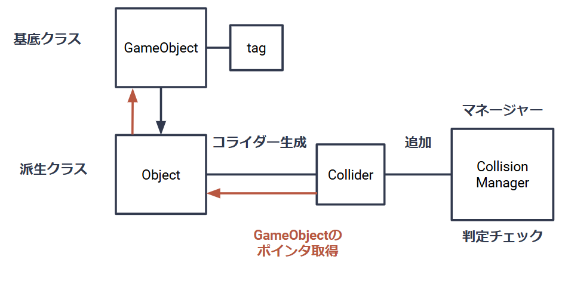

# コード概要

* * *

Editor

- [EditorObject](Engines/Editor/EditorObject.cpp)

UniqueEditorで配置するオブジェクトを定義しています。

- [MapEditor](Engines/Editor/MapEditor.cpp)

汎用的なステージエディターです。ImGuizmoを利用して3Dオブジェクトの配置がしやすくなっています。
最近は[UniqueEditor](Engines/Editor/UniqueEditor.cpp)をメインに使っているので古いです。

- [UniqueEditor](Engines/Editor/UniqueEditor.cpp)

ゲーム固有の処理に特化したステージエディターです。ゲーム内で使用するオブジェクトしか配置できないようになっています。
オブジェクトをクリックして選択ができる他、Undo、Redoも実装されています。

* * *

Game

- [Gimmick](Engines/Game/Gimmick/)

このフォルダ内では、ゲーム内のギミックの実装をしています。現在6つほどのギミックがあります。

- [Stage](Engines/Game/stage/Stage.cpp)

ゲームシーンでのオブジェクトの配置やステージの色の管理をしています。[Resources/Maps](Engines/Resources/Maps/)ファイル内のjsonファイルを読み込んで
オブジェクトの配置を行います。

 * * *

その他

- 当たり判定の実装方法について

当たり判定は主にOBBコライダーを使用して判定しています。また、コライダーを生成する際に自動的に
マネージャーに追加されるようにして、マネージャーにあるコライダー全てが当たり判定をチェックする
ようになっています。ゲーム内のオブジェクトは全て[GameObject](Engines/Engine/3d/GameObject.h)という基底クラスから派生して作成し、
コライダーを生成する時に、[GameObject](Engines/Engine/3d/GameObject.h)のポインタを渡すことで、タグを取得することが可能となっています。
この設計にすることで、何かと当たった時の処理記述をそれぞれのクラス内で完結させることができるようになったので、
コードの可読性向上に繋げることができました。

